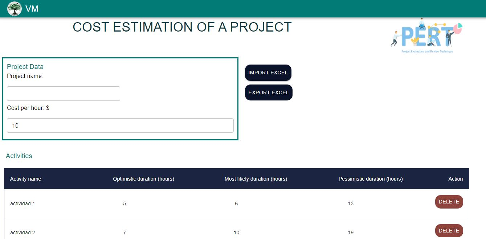

# How should you charge for a software project?
When someone begins the development of software, one question that with do is, how should I charge for my job? How should you calculate the cost of a project?. And there are different methods to perform this calculation, and you must be careful that the cost it charges does not cover your fees.
First, you need to establish specific objectives and functionalities that the project will have. Also, you should be establishing your cost per hour and How much time you need to finish the project.
The techniques of project software estimations can be elasticated into four, there are:
- Software estimation by expert judgment
- Software estimation by analogy
- Software estimation by decomposition
- Software estimation by means of estimation models

In this project, the Pert method is used.

# Pert method
Program Evaluation and Review Technique (PERT) is a method used to examine the tasks in a schedule and determine a Critical Path Method variation (CPM). It analyzes the time required to complete each task and its associated dependencies to determine the minimum time to complete a project. This helps in the creation of more realistic schedules and cost estimates.

For this analysis: 
- Step 1: Create a list with all activities to realize the project. The activities must be sequential.
- Step 2: Determine optimistic, pessimistic, and most likely estimates duration for each activity

Optimistic duration: This is the duration of the activity, if there are not any difficulties or unforeseen complications.

Most likely duration: This is the most likely duration the activity will take to complete. Small delays are taken into account and based on previous data for the duration of the activity. complications. 

Pessimistic duration: This is the maximum time required to complete an activity
- Step 3: Calculate the estimated Pert, standard deviation, and variance for each activity.
- Step 4: Estimate the total duration of the project and multiply by the cost per hour. 

Here you can see an example: [link](https://todopmp.com/ejemplo-estimacion-pert-multiples-actividades/)

## About this project
This project is about a web page where you can calculate the estimation total duration of a project using the PERT method. On this page, you can perform the following actions.
- Add the activities you do and three durations for this, Optimistic duration, Most likely duration, and Pessimistic duration
- Delete an activity
- Add the name project and cost per hour
- Import an Excel with the activities
- Export an Excel
 
 Once the activities have been entered, it will perform the calculation and display a table with the duration of the project in three percentages: 68%, 95% and 97%. Also, shows a graph with the duration.
 
[](public/pagePert.JPG)
[](public/pagePert2.JPG)

This project was coded using the next.js framework with Typescript. [DEMO](https://pert.vercel.app/)

## Clone the project 
```sh
git clone https://github.com/violeta-maldonado/pert.git
```
## Packages
Install the packages used in the project:
- [Redux Toolkit](https://redux-toolkit.js.org/)
- [MUI5](https://mui.com/getting-started/installation/)
- [Chart js](https://www.chartjs.org/docs/latest/api/)
- [Next js](https://nextjs.org/docs)

To install the packages use the next command
```sh
yarn add  @package
```
## Run the program

```sh
yarn run dev 
```

You can see the page in your local server http://localhost:3000

## License

[](http://badges.mit-license.org)

- This project is licensed under the terms of the **[MIT license](LICENSE)**
